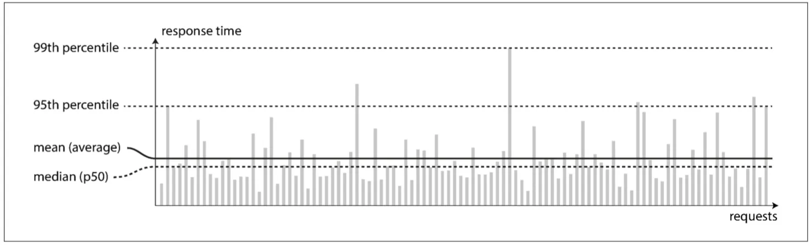
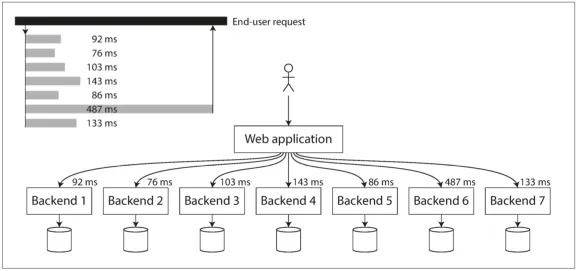

## 认识数据系统

单个组件往往无能满足所有数据处理与存储需求。因而需要将任务分解，每个组件负责高效完成其中一部分，多个组件依靠应用层代码驱动有机衔接起来。

软件系统中很重要的三个问题：

1. **可靠性**（Reliability）：当出现意外情况如硬件、软件故障、人为失误等，系统应可以继续正常运转：虽然性能可能有所降低，但确保功能正确。
2. **可扩展性**（Scalability）：随着规模的增长 ，例如数据 、流量或复杂性，系统应以合理的方式来匹配这种增长。
3. **可维护性**（Maintainability）：随着时间的推移，许多新的人员参与到系统开发和运维， 以维护现有功能或适配新场景等，系统都应高效运转。

## 可靠性

<mark>可靠性大致意味着：即使发生了某些错误，系统仍然可以继续正常工作。</mark>

对于软件的典型期望包括：

- 应用程序执行用户所期望的功能。
- 可以容忍用户出现错误或者不正确的软件使用方法。
- 性能可以应对典型场景、合理负载压力和数据量。
- 系统可以防止任何未经授权的访问和滥用。

### 基本定义

- **错误**（faults），**故障**：可能出错的事情。
- **容错**（fault-tolerant），**弹性**（resilient）：系统可应对错误。


**故障与失效**

故障与**失效**（failure）不完全一致。故障通常被定义为组件偏离其正常规格，而失效意味着系统作为一个整体停止，无法向用户提供所需的服务。


我们通常倾向于容忍故障而不是预防故障，但是页存在 “预防胜于治疗” 的情况，比如安全问题。

### 硬件故障

硬件故障可能是硬盘崩溃，内存故障，电网停电，甚至有人误拔了网线。

应对办法有：

1. **为硬件添加冗余来减少系统故障率**。当一个组件发生故障，冗余组件可以快速接管，之后再更换失效的组件。
2. **通过软件容错的方式来容忍多机失效**。云平台系统强调的总是灵活性与弹性，而非单台机器的可靠性，虚拟机实例经常会在实现无告警的情况下出现无法访问问题。

### 软件错误

区别于硬件故障的另一类别是系统内的软件问题。这些故障事先更难预料，并且因为节点之间由软件关联，因此往往会导致更多的系统故障。

导致软件故障的 bug 通常会长时间处于引而不发的状态，直到碰到特定的触发条件。解决办法：

1. 仔细考虑细节，包括认真检查依赖的假设条件于系统之间交互。
2. 进行全面的测试。
3. 进程隔离，允许进程崩溃并自动重启。
4. 反复评估，监控并分析生产环节的行为表现。

### 人为失误

人无法做到万无一失，运维者的配置错误是系统下线的首要原因。

解决办法：

1. **以最小出错的方式来设计系统**。例如精心设计的抽象层、API 以及管理界面，使 “做正确的事情” 很轻松，但搞破坏很复杂。
2. **想办法分离最容易出错的地方、容易引发故障的接口**。
3. **充分的测试**。从各单元测试到全系统集成测试以及手动测试。
4. **当出现人为失误时，提供快速的恢复机制以尽量减少故障影响**。例如快速回滚配置改动。
5. **设置详细而清晰的监控子系统，包括性能指标和错误率**。
6. **推行管理流程并加以培训**。

## 可扩展性

<mark>可扩展性是用来描述系统应对负载增加能力的术语。</mark>

### 描述负载

我们需要简洁地描述系统当前的负载，负载可以用称为**负载参数**的若干数字来描述。

例如，Twitter 的两个典型业务操作：

1. 发布 tweet 消息：用户可以快速推送新消息到所有的关注者，平均大约 4.6k request/sec，峰值约 12k request/sec。
2. 主页时间线浏览：平均 300k request/sec 查看关注对象的最新消息。

> - 方案一：将发送的新 tweet 插入到全局的 tweet 集合中，查询时做 join。
>   
>
> - 方案二：对每个用户的时间线维护一个缓存，当用户推送新 tweet 时将消息插入到每个关注者的时间线缓存中。
>   
>
> 两种方案在不同的场景下有不同的解决能力，因此后来也变成了两者结合的方式。

### 描述性能

描述系统负载之后，问题变成了：

- 负载增加，但系统资源（如 CPU、内存、网络带宽等）保持不变，系统性能会发生什么变化？
- 负载增加，如果要保持性能不变，需要增加多少资源？

在批处理系统如 Hadoop 中，我们通常关心**吞吐量**（throughput），及每秒可处理等记录条数，或者在指定数据集上运行作业所需要的总时间。

而在线系统通常更看重服务的**响应时间**（response time），及客户端从发送请求到接收响应之间的间隔。


**延迟与响应时间**

**延迟**（latency）和**响应时间**（response time）并不完全一样。通常响应时间是客户端看到的：处理处理请求时间外还包括来回网络延迟和各种排队延迟。延迟则是请求话费在处理上的时间。


考察系统响应时间最好使用**百分位数**（percentiles），将搜集到的响应时间信息从快到慢排序，中位数（median）就是列表中间的响应时间。中位数指标（p50）非常适合描述多少用户需要等待多长时间，而为了弄清楚异常值有多糟糕，则需要关注更大的百分位数如 95、99 和 99.99 值。

采用较高的响应时间百分位数（tail latencies，尾部延迟或长尾效应）很重要，他们直接影响用户的总体服务体验。

测量客户端的响应时间非常重要。可能会出现**头部阻塞**（服务器只能处理有限的请求，正在处理的少数请求可能会阻挡后续请求），网络延迟等。

### 应对负载增加的方法

实践中的百分位点，可以用一个滑动的时间窗口（比如 10 分钟）进行统计。可以对列表进行排序，效率低的话，考虑一下前向衰减，t-digest 等方法近似计算。

1. **垂直拓展**：升级到更强大的机器。
2. **水平拓展**：将负载分布到多个更小的机器。
3. **弹性系统**：检测负载增加后，自动添加更多计算资源。
4. **将数据库运行在一个节点上**：无状态服务分布然后扩展至多台机器相对比较容易，而有状态服务从单个节点扩展到分布式多机环境的复杂性会大大增加。

## 可维护性

从软件设计时开始考虑，尽可能减少维护期间的麻烦，甚至避免造出容易过期的系统。软件系统的三个设计原则：

1. 可运维性：方便运营团队来保持系统平稳运行。
2. 简单性：简化系统复杂性，使新工程师能轻松理解系统。
3. 可演化性：后续工程师能够轻松地对系统进行改进，并根据需求变化将其适配到非典型场景。也称为可延伸性、易修改性或可塑性。

### 可运维性：运维更轻松

“良好的操作性经常可以化解软件的局限性，而不规范的操作规则可以轻松击垮软件”。

- 提供对系统运行时行为和内部的可观测性，方便**监控**。
- 支持**自动化**，与标准工具集成。
- 避免绑定特定的机器，这样在整个系统不间断运行的同时，允许车机器停机维护。
- 提供**良好的文档和易于理解的操作模式**，诸如"如果我做了 X，会发生 Y"。
- 提供良好的默认配置，且允许管理员在需要时方便地修改默认值直。
- 尝试自我修复，在需要时让管理员手动控制系统状态。
- 行为可预测，减少意外发生。

### 简单性：简化复杂度

随着项目越来越大，就会越来越复杂和难以理解。这种复杂性拖慢了开发效率，增加了维护成本。

简化系统设计，主要意味着消除意外方面的复杂性。而最好手段之一就是**抽象**。一个好的设计抽象可以隐藏大量的实现细节，并对外提供干净、易懂的接口。

### 可演化性：易于改变

我们的目标是可以轻松地修改数据系统，使其适应不断变化的的需求，这和简单性与抽象性密切相关：简单易懂的系统往往比复杂的系统更容易修改。这是一个非常重要的理念，我们将采用另一个不同的词来指代数据系统级的敏捷性，即可演化性。
