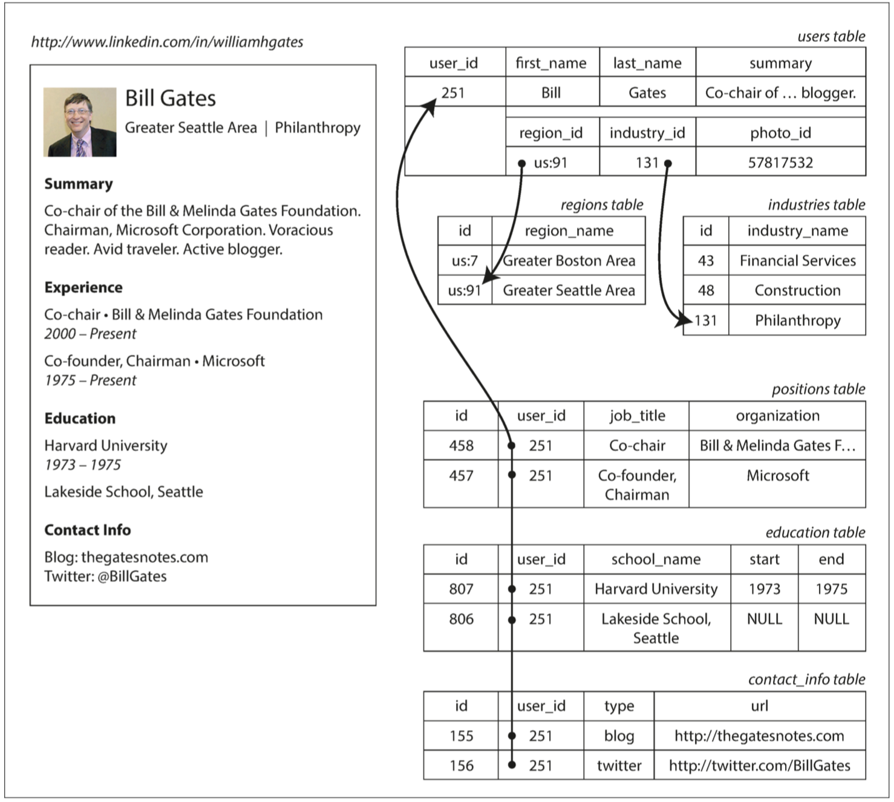
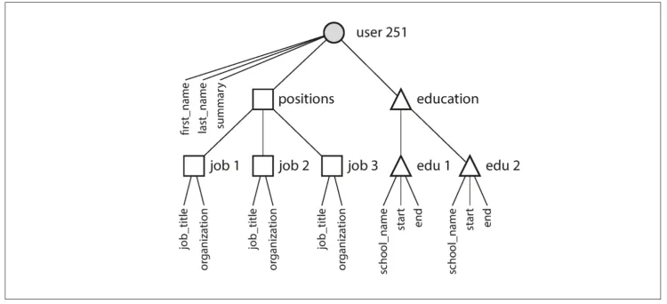
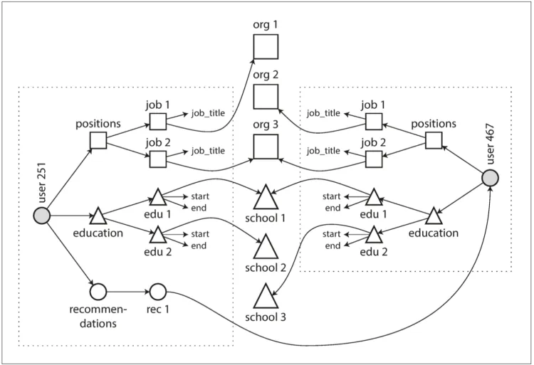
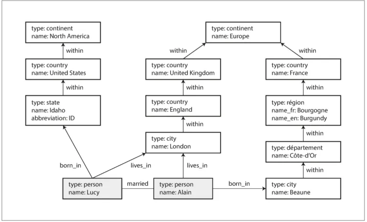

数据模型可能是开发软件最重要的部分，对软件的编写方式和如何思考待解决的问题都有深远影响。

复杂的应用程序可能会有更多的中间层，例如基于 API 来构建上层 API，但是基本思想相同：**每层都提供一个简洁的数据模型来隐藏下层的复杂性**。这些抽象机制使得不同的人群可以高效协作。

历史上，数据最初被表示为一棵大树（**层次模型**），但是这<u>不利于表示多对多关系</u>，所以发明了**关系模型**来解决这个问题。最近开发人员发现一些应用程序也不太适合关系模型，新的非关系「NoSQL」数据存储便兴起来，并且存在两个主要方向上的分歧：

1. **文档数据库**的目标用例上数据来自于自包含文档，且一个文档与其他文档之间的<u>关联很少</u>。
2. **图数据库**则针对相反的场景，目标用例上所有数据都可能会<u>互相关联</u>。


文档数据库和图数据库有一个共同点，就是它们通常不会对存储的数据强加某个模式，这可以使应用程序更容易适应不断变化的需求。
不过应用程序可能仍然会假定数据具有一定的结构，只不过是模式是**显示（写时强制）**还是**隐式（读时处理）**的问题。


所有这三种模型（关系模型、文档模型和图模型）如今都有广泛使用，并且在各自的目标领域都足够优秀。

## 关系模型

SQL 可能是现在最著名的数据模型，是一种**关系模型**：数据被组织成关系（relations，在 SQL 中称为表 table），其中每个关系都是元组（tuples）的无序集合（在 SQL 中称为行）。其目标就是将实现细节隐藏在更简洁的接口后面。

### 对象-关系不匹配

由于兼容性问题，应用层代码中的对象与表、行和列的数据库模型之间需要一个笨拙的转换层。模型之间的脱离有时被称为**阻抗失谐**。

Hibernate 这样的**对象-关系映射（ORM object-relational mapping）**框架可以减少这个转换层所需的样板代码的数量，但是它们不能完全隐藏着两个模型之间的差异。

### 多对一与多对多的关系

使用关系模式来表示简历：


为什么在 SQL 中，地域和公司都以 ID，而不是字符串进行标识呢？

1. ID 对人类没有任何意义，所以永远不需要改变，可以规范化人类的信息。那么就会存在多对一的关系（多个人对应了同一个 ID）。
2. 在关系数据库 SQL 中，所有使用它的地方可以用 ID 来引用其他表中的行。
3. 但是文档数据库（比如 JSON），对连接支持很弱。

如果数据库本身不支持联结，则必须在应用程序代码中，通过对数据库进行多次查询来模拟联结。

### NoSQL 的诞生

**NoSQL：不仅仅是 SQL（Not only SQL）。**

采用 NoQSL 的几个驱动因素：

1. 比关系数据库**更好的扩展性**需求，包括支持超大数据集或超高写入吞吐量。
2. 相比商业数据库产品，**免费和开源**软件更受偏爱。
3. 关系模型不能很好地支持一些**特殊的查询**操作。
4. 受挫于关系模型的限制性，渴望一种更具**多动态性与表现力**的数据模型。

不同的应用程序有不同的需求，某个用例的最佳技术选择未必适合另一个用例。在可预见的将来，<u>关系数据库可能仍然将与各种非关系数据存储一起使用，也被称为<mark>混合持久化</mark></u>。

## 文档模型

对于像简历这样的数据结构，他主要是一个自包含的文档（document），因此用 JSON 表示非常合适，面向文档的数据库都支持该数据类型。<u>JSON 模型减少了应用程序代码和存储层之间的阻抗失配，**具有更好的局部性**。缺乏模式常常被认为是一个优势，因为相反的带来的是更多的灵活性。</u>

<center></center>

```json
{
  "user_id": 251,
  "first_name": "Bill",
  "last_name": "Gates",
  "summary": "Co-chair of the Bill & Melinda Gates... Active blogger.",
  "region_id": "us:91",
  "industry_id": 131,
  "photo_url": "//p/7/000/253/05b/308dd6e.jpg",
  "positions": [
    {
      "job_title": "Co-chair",
      "organization": "Bill & Melinda Gates Foundation"
    },
    {
      "job_title": "Co-founder, Chairman",
      "organization": "Microsoft"
    }
  ],
  "education": [
    {
      "school_name": "Harvard University",
      "start": 1973,
      "end": 1975
    },
    {
      "school_name": "Lakeside School, Seattle",
      "start": null,
      "end": null
    }
  ],
  "contact_info": {
    "blog": "http://thegatesnotes.com",
    "twitter": "http://twitter.com/BillGates"
  }
}
```

### 文档数据库是否在重演历史？

虽然关系数据库中经常使用多对多的关系和联结，但文档数据库和 NoSQL 再次引发了如何最佳表示数据关系的争论。

从以下角度来看，文档数据库是某种方式的层次模型：即在其父纪录中保存了嵌套记录（一对多关系），而不是存储在单独的表中。

但是<u>**在表示多对一和多对多的关系时，关系数据库和文档数据库并没根本的不同**</u>：相关项都由唯一的标识符引用，该标识符在关系模型中被称为外键，在文档模型中被称为**文档引用**。

<center></center>

### 关系数据库和文档数据库现状

支持文档数据模型的主要论点是<u>**模式灵活性**，由于局部性而带来较好的性能</u>。对于某些应用来说，它更接近于应用程序所使用的数据结构。
关系模型则强在<u>联结操作、多对一和多对多关系更简洁的表达</u>上，与文档模型抗衡。

#### 哪种数据模型的应用代码更简单？

对于具有类似文档结构（即一对多关系树，通常一次加载整个树）的应用数据，文档模型更为合适，而关系模型会使得模式更加笨重以及不必要的应用代码复杂化。

在文档数据库中，对联结的支持不足是否是问题取决于应用程序。如果应用分析程序中永远不需要使用多对多关系，那就不是问题。但如果确实存在多对多关系，可能就需要在应用程序代码中模拟联结，但是这将会使应用程序变得复杂、性能更差。

通常无法一概而论哪种数据模型的应用代码更简单。这主要取决于数据项之间的关系类型。对于高度关联的数据，文档模型不太适合，关系模型可以胜任。而**图模型**，则是最为自然的。

#### 文档模型的模式灵活性

大多数文档数据库，以及关系数据库中的 JSON 支持，都不会对文档中的数据强制执行任何模式。

- 文档数据库有时被称为「**无模式**」，但其实数因为读数据的代码通常采用某种结构而存在某种隐形模式，而不是由数据库强制执行。
- 更准确说应该是「**读时模式**」，即数据结构是隐式的，只有在读取时才解释。与「**写时模式**」在数据库确保数据写入时都必须遵循相对应。

当应用程序需要改变数据格式时，这些方法之间的差异就尤其明显。

- 读时模式变更字段很容易，只用改应用代码
- 写时模式变更字段速度很慢，而且要求停运。它的这种坏名誉并不是完全应得的：大多数关系数据库系统可在几毫秒内执行 `ALTER TABLE` 语句。MySQL 是一个值得注意的例外，它执行 ALTER TABLE 时会复制整个表，这可能意味着在更改一个大型表时会花费几分钟甚至几个小时的停机时间，尽管存在各种工具来解决这个限制。

#### 查询的数据局部性

文档通常存储为 JSON、XML 或其二进制变体的连续字符串。

- 在频繁访问整个文档时存储局部性具有性能优势。局部性优势仅适用于同时访问文档大部分内容的场景。
- 更新文档时通常会重写整个文档，只有不改变源文档大小时才可以容易地原地覆盖更新。因此通常建议文档应该尽量小且避免写入时增加文档大小。

#### 文档数据库和关系数据库的融合

- 关系数据库都逐步增加了对 JSON 和 XML 的支持。
- 融合关系模型与文档模型是未来数据库发展的一条很好的途径。

## 图模型

关系模型能过处理简单的多对多关系，但是随着数据之间的关联越来越复杂，将数据建模转化为图模型为更加自然。

图由两种对象组成：**顶点（节点或实体）**和**边（关系或弧）**。图更为强大的用途在于提供了单个数据存储区中保存完全不同类型对象的一致性方式。

<center></center>

### 属性图

在属性图模型中，每个**顶点（vertex）**包括：

- 唯一的标识符
- 一组出边（outgoing edges）
- 一组入边（ingoing edges）
- 一组属性（键值对）

每条**边（edge）**包括：

- 唯一标识符
- 边的起点/尾部顶点（tail vertex）
- 边的终点/头部顶点（head vertex）
- 描述两个顶点之间关系类型的标签
- 一组属性（键值对）

使用关系模式来表示属性图：

```sql
CREATE TABLE vertices (
  vertex_id  INTEGER PRIMARY KEY,
  properties JSON
);

CREATE TABLE edges (
  edge_id     INTEGER PRIMARY KEY,
  tail_vertex INTEGER REFERENCES vertices (vertex_id),
  head_vertex INTEGER REFERENCES vertices (vertex_id),
  label       TEXT,
  properties  JSON
);

CREATE INDEX edges_tails ON edges (tail_vertex);
CREATE INDEX edges_heads ON edges (head_vertex);
```


**重要方面：**

1. 任何顶点都可以有一条边连接到任何其他顶点。没有模式限制哪种事物可不可以关联。
2. 给定任何顶点，可以高效地找到它的入边和出边，从而遍历图，即沿着一系列顶点的路径前后移动。
3. 通过对不同类型的关系使用不同的标签，可以在一个图中存储几种不同的信息，同时仍然保持一个清晰的数据模型。
   

## 数据查询语言

鉴于对其他数据库的掌握不多，本章内容读下来也只是模模糊糊看了个大概，数据查询语言部分暂不总结。
