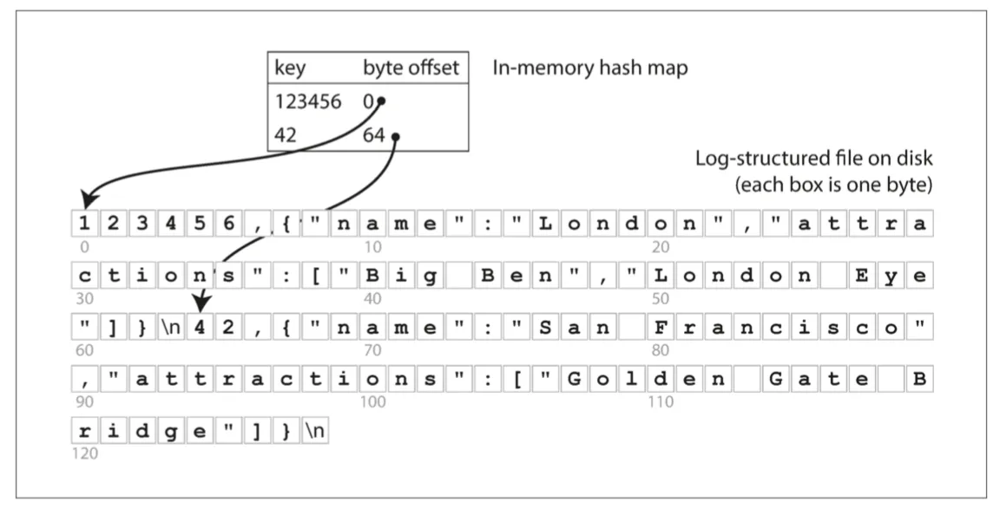
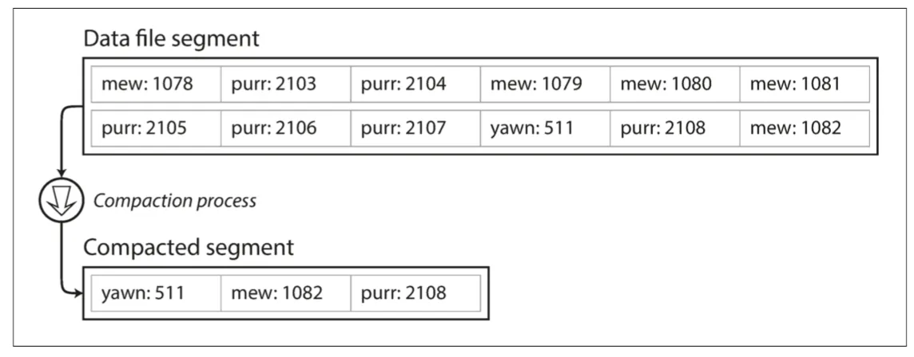
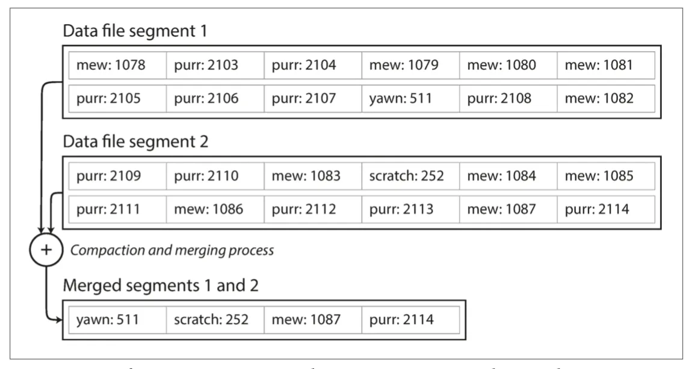
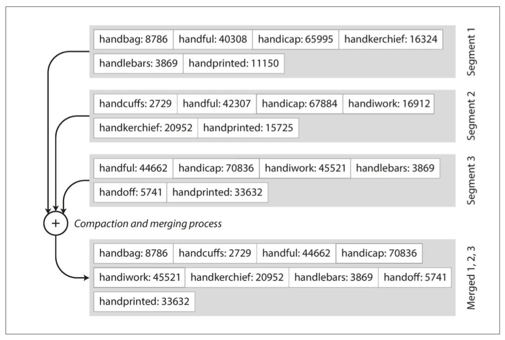
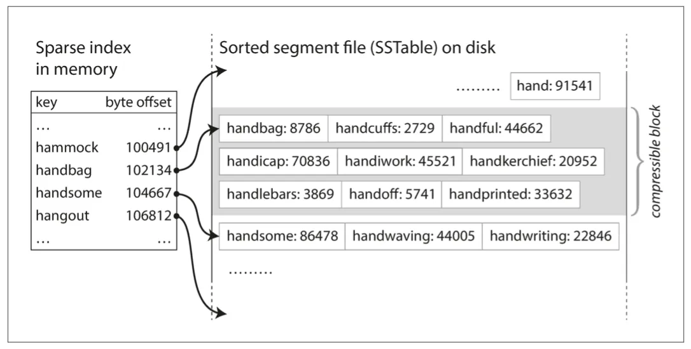
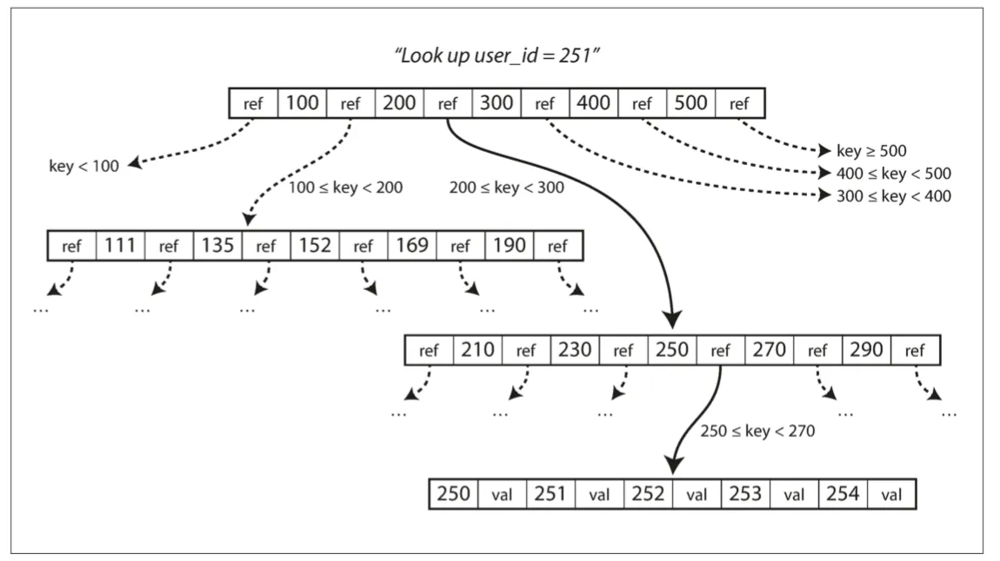
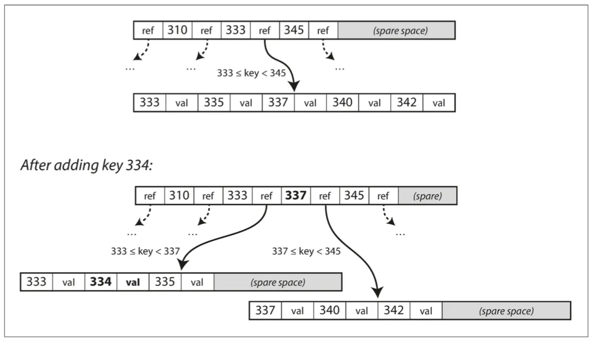

## 数据库核心：数据结构

### 最简单的数据库

世界上最简单的数据库可以用两个 Bash 函数实现：

```shell
#!/bin/bash
db_set () {
    echo "$1,$2" >> database
}

db_get () {
    grep "^$1," database | sed -e "s/^$1,//" | tail -n 1
}
```

这两个函数实现了键值存储的功能。

- 执行 db_set key value ，会将**键（key）**和**值（value）** 存储在数据库中。键和值（几乎）可以是你喜欢的任何东西，例如，值可以是 JSON 文档。
- 调用 db_get key ，查找与该键关联的最新值并将其返回。

`db_set` 函数对于极其简单的场景其实有非常好的性能，因为在文件尾部追加写入通常是非常高效的。但如果这个数据库中有着大量记录，则这个`db_get` 函数的性能会非常糟糕。

### 索引

为了高效查找数据库中特定键的值，我们需要一个数据结构：**索引（index）**。<u>索引背后的大致思想是，保存一些额外的元数据作为路标，帮助你找到想要的数据。</u>维护额外的结构会产生开销，适当的索引可以加快读取查询，但每个索引都会减慢写速度；因此索引的选择也是一项重要的权衡。

### 哈希索引

key-value 存储与大多数编程语言所内置的字典结构非常相似，通常采用**hash map（或 hash table，哈希表）**来实现。

假设我们的数据存储只是一个追加写入的文件，最简单的索引策略就是：保留一个内存中的哈希映射，其中每个键都映射到一个数据文件中的字节偏移量，指明了可以找到对应值的位置。



#### 只追加到一个文件，要如何避免最终用尽磁盘空间？

1. 将日志进行**分段**（特定大小的段），当日志增长到特定尺寸时关闭当前段文件，并开始写入一个新的段文件。
2. 然后，我们就可以对这些段进行**压缩（compaction）**。压缩意味着在日志中丢弃重复的键，只保留每个键的最近更新。



3. 也可以把多个段的内容压缩合并到一起。



#### 重要问题

1. 文件格式。**csv 不好，使用二进制格式更快。**
2. 删除记录。删除一个键，则必须在数据文件（有时称为逻辑删除）中附加一个**特殊的删除记录**。当日志段被合并时，逻辑删除告诉合并过程放弃删除键的任何以前的值。
3. 崩溃恢复。如果数据库重新启动，则内存散列映射将丢失。可以根据日志文件重新恢复每个段的哈希映射，但段很大的时候，很费时间。Bitcask 通过**存储**加速恢复磁盘上每个段的哈希映射的快照，可以更快地加载到内存中。
4. 部分写入记录。数据库可能随时崩溃，包括将记录附加到日志中途。。Bitcask 文件包含**校验值**，允许检测和忽略日志的这些损坏部分。
5. 并发控制。写操作是以严格顺序的顺序附加到日志中的，所以常见的方法是**只有一个写线程**。读操作可以有**多个线程同时读取**。

#### 为什么采用追加模式，而不是不更新文件，用新值覆盖旧值？

- 追加和分段合并是<u>**顺序写入**操作，通常比随机写入快得多</u>，尤其是在磁盘旋转硬盘上。在某种程度上，顺序写入在基于闪存的固态硬盘（SSD） 上也是优选的。
- 如果段文件是附加的或不可变的，**并发和崩溃恢复就简单多**了。
- 合并旧段可以避免数据文件随着时间的推移而分散的问题。

#### 局限性

- 散列表必须能放进内存：当有很多键的时候，Hash 冲突，**占用内存**。
- **范围查询效率不高**：不支持查一个取值区间内的所有键。

### SSTables

在之前的存储中，每个日志结构存储段都是一系列键值对。这些对按照它们写入的顺序出现，而不是键值对的顺序。
我们做一个简单的改变：我们要求<u>键值对的序列按键排序</u>。把这个格式称为**排序字符串表（Sorted String Table）**，简称 **SSTable**。同时，要求每个键只在每个合并的段文件中出现一次（压缩过程已经保证）。

SSTables 对比哈希索引的优点：

1. 合并段**更加简单高效**，即使文件大于可用内存。如果在几个输入段中出现相同的键，保留最近段的值，并丢弃旧段中的值。
2. 为了在文件中找到一个特定的键，你**不再需要保存内存中所有键的索引**。
3. **压缩节省磁盘空间，还减少了 I/O 带宽的占用**。记录保存到一个块中并在写磁盘之间将其压缩，然后稀疏内存索引的每个条目指向压缩块的开头。





### LSM 树

**LSM 树是以日志结构的合并树（Log-Structed Merge-Tree）。**

LSM 树的算法本质就是在解决 SSTables 的构建和维护问题（存储引擎的基本工作流程）：

1. 写入时，将其添加到**内存中的平衡树数据结构**（例如，红黑树）。这个内存树有时被称为内存表（memtable）。
2. 当内存表大于某个阈值（通常为几兆字节）时，将其**作为 SSTables 文件写入磁盘**。这可以高效地完成，因为树已经维护了按键排序的键值对。新的 SSTables 文件成为数据库的最新部分。当 SSTables 被写入磁盘时，写入可以继续到一个新的内存表实例。
3. 为了提供读取请求，首先尝试<u>在内存表中找到关键字</u>，然后在<u>最近的磁盘段中</u>，然后在下一个<u>较旧的段中找到该关键字</u>。
4. 后台进程周期性地执行**段合并与压缩**过程,以合并多个段文件,并丢弃那些已被覆盖或删除的值。

#### 解决数据库崩溃，最近的写入（在内存表中，但尚未写入磁盘）将丢失的问题

在磁盘上保存一个单独的日志，每个写入都会立即被附加到磁盘上，该日志不是按排序顺序，但这并不重要，因为它的唯一目的是在崩溃后恢复内存表。每当内存表写出到 SSTables 时，相应的日志都可以被丢弃。

#### 性能优化

1. 当查找数据库中不存在的键时，LSM 树算法可能会很慢：您必须检查内存表，然后将这些段一直回到最老的（可能必须从磁盘读取每一个），然后才能确定键不存在：
   使用额外的**布隆过滤器**。
2. 不同的策略会影响甚至决定 SSTables 被压缩和合并的顺序和时间：
   - **大小分级**：较新和较小的 SSTables 被连续合并到较旧和就大的 SSTable。
   - **分层压缩**：键的范围分裂成更多更小的 SSTable，旧数据被移动到单独的层级。

即使有许多细微的差异，但 LSM-tree 的基本思想（保存在后台合并的一系列 SSTable）却足够简单有效。即使数据集远远大于可用内存，它仍然能够正常工作。由于数据按排序存储，因此可以有效地执行区间查询（从最小值到最大值扫描所有的键），并且由于磁盘是顺序写入的，所以 LSM-tree 可以支持**非常高的写入吞吐量**。

### B 树

像 SSTables 一样，B 树保持按键排序的键值对，这允许高效的键值查找和范围查询。

日志结构索引将数据库分解为可变大小的段，通常是几兆字节或更大的大小，并且总是按顺序编写段。B 树将数据库分解成**固定大小的块或页面**，传统上大小为 4KB（有时会更大），并且**一次只能读取或写入一个页面**。这种设计更接近于底层硬件，因为磁盘也被安排在固定大小的块中。

每个页面都可以使用**地址或位置**来标识，这允许一个页面引用另一个页面——类似于指针，但在磁盘而不是在内存中。

- **分支因子**：一个页中所包含的子页引用数量，大小取决于存储页面引用范围边界所需要的空间总量，通常为几百个。
- 查找过程：从 B 树的根开始，沿着符合的范围找到子页，逐步缩小范围直到找到键的位置。
  
- 更新过程：搜索包含该键的页，更改页中的值并写回磁盘。
- 插入过程：找到范围包含该键的页，将其添加到页面中。<u>如果页面中没有足够的空间，则将其分成两个半满页面，并更新父页面以解释键范围的新分区</u>。
  
- 删除过程：找到该键并删除，同时还要保持树的平衡。
- 深度：该算法确保树保持平衡：具有 n 个键的 B 树总是具有 $O(log n)$ 的深度。大多数数据库可以放入一个三到四层的 B 树，所以你不需要遵追踪多页面引用来找到你正在查找的页面。 （分支因子为 500 的 4KB 页面的四级树可以存储多达 256TB 。）

#### 让 B 树更可靠

B 树的基本底层写操作是**用新数据覆盖磁盘上的页面**。<u>假定覆盖不改变页面的位置</u>；而日志结构索引（如 LSM 树）只附加到文件（并最终删除过时的文件），但从不修改文件。

插入导致页面过度而拆分页面，则需要编写已拆分的两个页面，并覆盖其父页面以更新对两个子页面的引用。这是一个危险的操作，因为如果数据库在仅有一些页面被写入后崩溃，那么最终将导致一个损坏的索引（例如，可能有一个孤儿页面不是任何父项的子项） 。

- 预写式日志（WAL）：为了使数据库对崩溃具有韧性，B 树实现通常会带有一个额外的磁盘数据结构：**预写式日志（WAL, write-ahead-log）**（也称为**重做日志（redo log）**）。<u>这是一个仅追加的文件，每个 B 树修改都可以应用到树本身的页面上。当数据库在崩溃后恢复时，这个日志被用来使 B 树恢复到一致的状态.</u>
- 并发访问：更新页面时，如果多个线程要同时访问 B 树，则需要仔细的并发控制，否则可能会看到树处于不一致的状态。通过使用**锁存器（latches）（轻量级锁）**保护树的数据结构来完成而 LSM 比较简单：在后台完成所有的合并，不干扰查询；通过「**原子交换**」把旧的分段变为新的分段。

#### B 树优化

- 使用「**写时复制方案** 」，而不是不是覆盖页面并维护 WAL 进行崩溃恢复。

  修改的页面被写入到不同的位置，并且树中的父页面的新版本被创建，指向新的位置。这种方法对于并发控制也很有用。

- 保存键的**缩略信息**，而不是完整的键。

  这样可以节省页空间，特别是在树中间的页中，只需要提供足够的信息来描述键的起止范围。这样可以将更多的键压入到页中，<u>让树具有更高的分支因子，从而减少层数</u>。

- 不方便扫描大部分关键词的范围查找。

  许多 B 树实现尝试布局树，使得叶子页面按顺序出现在磁盘上。但是，随着树的增长，维持这个顺序是很困难的。相比之下，由于 LSM 树在合并过程中一次又一次地重写存储的大部分，所以它们更容易使顺序键在磁盘上彼此靠近。

- 添加**额外的指针**到树中。

  例如，每个叶子页面可以在左边和右边具有对其兄弟页面的引用，这允许不跳回父页面就能顺序扫描。

- B 树的变体如分形树借用一些日志结构的思想来减少磁盘寻道（而且它们与分形无关）。

### 对比 B-tree 和 LSM-tree

**通常 LSM 树的写入速度更快，而 B 树的读取速度更快。**
LSM 树上的读取通常比较慢，因为它们必须在压缩的不同阶段检查几个不同的数据结构和 SSTables。

#### LSM-tree 的优点

B 树索引必须至少**两次写入**每一段数据：<u>一次写入预先写入日志，一次写入树页面本身</u>（也许再次分页）即使在该页面中只有几个字节发生了变化，也需要一次编写整个页面的开销。有些存储引擎甚至会覆盖同一个页面两次，以免在电源故障的情况下导致页面部分更新。

由于反复压缩和 SSTable 的合并，日志结构索引也会重写数据多次。这种影响（<u>在数据库内，由于一次数据库写入请求导致的多次磁盘写</u>）称为**写放大**。对于大量写密集的应用程序，性能瓶颈很可能在于数据库写人磁盘的速率。在这种情况下，<u>写放大具有直接的性能成本：存储引擎写入磁盘的次数越多，可用磁盘带宽中每秒可以处理的写入越少</u>。

1. LSM 树通常能够比 B 树支持**更高的写入吞吐量**。
   - 部分原因是它们有时具有<u>较低的写放大</u>（尽管这取决于存储引擎配置和工作负载）
   - 部分是因为它们顺序地写入<u>紧凑的 SSTable 文件而不是必须覆盖</u>树中的几个页面
2. LSM 树可以支持**更好的压缩**。由于 LSM-tree 不是面向页的，并且定期重写 SSTables 以消除碎片化，所以它们具有<u>较低的存储开销</u>，特别是在使用分层压缩时。

#### LSM-tree 的缺点

日志结构存储的缺点是压缩过程**有时会干扰正在进行的读写操作**。B 树的行为则相对更具可预测性。

1. 磁盘的有限写入带宽需要在初始写入（记录和刷新内存表到磁盘）和在后台运行的压缩线程之间**共享**。

   写入空数据库时，全部的磁盘带宽可用于初始写入，<u>但数据库的数据量越大，压缩所需的磁盘带宽就越多</u>。

2. 如果写入吞吐量很高并且压缩没有仔细配置，那么就会**发生压缩无法匹配新数据写入速率的情况**。
3. **不能提供较好的事务语义**。

   B-tree 的优点则是每个键都恰好唯一对应于索引中的某个位置，日志结构的存储引擎可能在不同的段中具有相同键的多个副本。

### 其他索引结构

key-value 索引像关系模型中的**主键（primarykey）索引**。主键唯一标识关系表中的一行，或文档数据库中的一个文档，或图形数据库中的
一个顶点。数据库中的其他记录可以通过其**主键（或 ID）**来引用该行/文档/顶点，该索引用于解析此类引用。

#### 在索引中存储值

索引中的键是查询搜索的对象，而值则可以是以下两类之一：

1. 实际行（文档，顶点）。
2. 对其他地方存储的行的引用。

在后一种情况下，存储行的具体位置被称为**堆文件**，并且它不以特定的顺序存储数据（它可以是追加的，或者记录删掉的行以便用新数据在之后覆盖它们）。堆文件方法比较常见，这样当存在多个二级索引时，它可以避免复制数据，即每个索引只引用堆文件中的位置信息，实际数据仍保存在一个位置。

在某些情况下，从索引到堆文件的**额外跳转对于读取来说说意味着太多的性能损失**，因此可能希望将索引行直接存储在索引中。这被称为**聚集索引**。例如，在 MySQL InnoDB 存储引擎中，表的主键始终是聚集索引，二级索引引用主键（而不是堆文件位置）。在 SQLServer 中，可以为每个表指定一个聚集索引。

在**聚集索引（clustered index）**（在索引中存储所有行数据）和**非聚集索引（nonclustered index）**（仅在索引中存储对数据的引用）之间的折衷被称为包含列的索引（index with included columns）或**覆盖索引（covering index）**，其存储表的一部分在索引内。允许通过单独使用索引来回答一些查询。<u>加快了读取速度，但是增加了额外的存储空间，增加了写入开销，还要事务保证。</u>

#### 多列索引

最常见的多列索引类型称为**级联索引**，它通过将一列追加到另一列，将几个字段简单地组合成一个键（索引的定义指定字段连接的顺序）。

**多维索引**是更普遍的一次查询多列的方法，这对地理空间数据尤为重要。

#### 全文搜索和模糊索引

**全文搜索引擎**允许搜索一个单词以扩展为包括该单词的同义词，忽略单词的语法变体，并且搜索在相同文档中彼此靠近的单词的出现，并且支持各种其他功能取决于文本的语言分析。为了处理文档或查询中的拼写错误，Lucene 能够在一定的编辑距离内搜索文本（编辑距离 1 意味着添加，删除或替换了一个字母）

#### 在内存中存储一切

内存数据库。某些内存中的键值存储（如 Memcached）仅用于缓存，在重新启动计算机时丢失的数据是可以接受的。但其他内存数据库的目标是持久性，可以通过特殊的硬件（例如电池供电的 RAM），将更改日志写入磁盘，将定时快照写入磁盘或通过复制内存来实现，记忆状态到其他机器。

#### 优势

1. **性能优势**：省去了将内存数据结构编码为磁盘数据结构的开销。
2. **提供了难以用基于磁盘的索引实现的数据模型**。例如，Redis 为各种数据结构（如优先级队列和集合）提供了类似数据库的接口。因为它将所有数据保存在内存中，所以它的实现相对简单。

#### 内存不够用怎么办

**反缓存（anti-caching）**方法通过在内存不足的情况下将最近最少使用的数据从内存转移到磁盘，并在将来再次访问时将其重新加载到内存中。这与操作系统对虚拟内存和交换文件的操作类似，但数据库可以比操作系统更有效地管理内存，因为它可以按单个记录的粒度工作，而不是整个内存页面。尽管如此，这种方法仍然需要索引能完全放入内存中。


