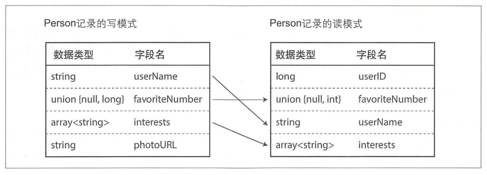

应用程序不可避免地需要随时间而变化、调整，在大多数情况下，更改应用程序功能时，也需要更改其存储的数据：可能需要捕获新的字段或记录类型，或者需要以新的方式呈现已有数据。

当数据格式或模式发生变化时，经常需要对应用程序代码进行相应的调整。但是新旧版本的代码，以及新旧数据格式，可能会同时在系统内共存。为了使系统继续顺利运行，需要保持双向的兼容性：

- **向后兼容**：较新的代码可以读取由旧代码编写的数据。
- **向前兼容**：较旧的代码可以读取由新代码编写的数据。

## 数据编码格式

程序通常使用（至少）两种不同的数据表示形式：

1. 在内存中，数据保存在<u>对象、结构体、列表、数组、哈希表和和树等结构中</u>。这些数据结构针对 CPU 的高效访问和操作进行了优化（通常使用指针）。
2. 将数据写入文件或通过网络发送时，必须将其编码为某种<u>自包含的字节序列（例如 JSON 文档）</u>。由于指针对其他进程没有意义，所以这个字节序列表示看起来与内存中使用的数据结构大不一样。

因此，在这两种表示之间需要进行类型的转化。<u>从内存中的的表示到字节序列的转化</u>称为**编码（或序列化等）**，相反的过程称为**解码（或解析，反序列化）**

### 语言特定的格式

许多编程语言都内置支持将内存中的对象编码为字节序列。这些编码库使用起来非常方便，但因为以下原因使得<u>使用语言内置的编码方案通常不是个好主意</u>：

1. 编码通常与特定的编程语言绑定在一起，大部分时候确定了编码方式就几乎确定了特定的编程语言。对于系统或组织之间的**集成会存在一些困难**。
2. 解码过程中可能会存在**安全问题**：如果攻击者可以让应用程序解码任意的字节序列那么它们可以实例化任意的类；这通常意味着，它们可以做些可怕的事情，比如远程执行任意代码。
3. 为了快速且简单地编码数据，经常**忽略向前和向后兼容性等问题**。
4. 不太重视效率。

### JSON、XML 与二进制变体

JSON、XML 和 CSV 都是文本格式，因此具有不错的可读性。不过 XML 经常被批评过于冗长和不必要的复杂；而 JSON 由于 Web 浏览器的内置支持和相对于 XML 的简单性，更受欢迎。当然，这其中还有一些微妙的问题：

1. **数字编码有很多模糊之处**。在 XML 和 CSV 中无法区分数字和碰巧由数字组成的字符串；JSON 区分字符串和数字但不区分整数和浮点数，并且不指定精度。
2. JSON 和 XML 对 Unicode 字符串（即人类可读文本）有很好的支持，但是它们**不支持二进制字符串（没有字符编码的字节序列）**。
3. XML 和 JSON 都**有可选的模式支持**，而 CSV 没有。

尽管存在缺陷，但仍可以用于很多应用。只要人们就格式本身达成一致，格式多么美观或者高效往往不太重要。

#### 二进制编码

JSON 不像 XML 那么冗长，但与二进制格式相比两者者仍然占用大量空间，于是就开发了大量

```json
{
  "userName": "Martin",
  "favoriteNumber": 1337,
  "interests": ["daydreaming", "hacking"]
}
```

#### MessagePack

MessagePack 是一种 JSON 的二进制编码


#### Thrift

```thrift
struct Person {
  1: required string userName,
  2: optional i64 favoriteNumber,
  3: optional list<string> interests
}
```

Thriift 有两种不同的二进制编码，分别称为 BinaryProtocol 和 CompactProtocol。主要区别在于后者通过将字段类型和标签号打包到单字节中，并使用可变长度整数来实现紧凑性。


#### Protocol Buffers

```proto
message Person {
  required string user_name = 1;
  optional int64 favorite_number = 2;
  repeated string interests = 3;
}
```


#### Avro

Avro 也使用模式来指定编码的数据结构。它有两种模式语言：一种（Avro IDL）用于人工编辑，另一种（基于 JSON ）更易于机器读取。

```Avro
record Person {
  string userName;
  union{null,long} favoriteNumber = null;
  array<string> interests;
}
```

```json
{
  "type": "record",
  "name": "Person",
  "fields": [
    {
      "name": "userName",
      "type": "string"
    },
    {
      "name": "favoriteNumber",
      "type": ["null", "long"],
      "default": null
    },
    {
      "name": "interests",
      "type": { "type": "array", "items": "string" }
    }
  ]
}
```

请注意模式中没有标签编号，是按照顺序遍历这些字段的。


### 字段标签和模式演化

**模式演化**：模式不可避免地需要随着时间而不断变化。

- **读模式**：当应用程序想要对某些数据进行编码（例如将其写入文件或数据库，以及通过网络发送）时，它使用所知道的模式的任何版本来编码数据，例如可以编译到应用程序中的模式。
- **写模式**：当应用程序想要解码某些数据（例如从文件或数据库读取数据，或者从网络接收数据等）时，它期望数据符合某个模式。

#### Thrift、Protocol Buffers

1. 修改字段：标签（field tag）对编码数据的含义至关重要。可以轻松更改模式中字段的名称，而编码永远不直接引用字段名称。但不能随便更改字段的标签，它会导致所有现有编码数据无效。
2. 新增字段：
   - 向前兼容（旧代码可以读取由新代码编写的记录）：当旧代码试图读取新数据时，遇到不能识别的新字段可以进行简单的忽略。
   - 向后兼容（新代码可以读取由旧代码编写的记录）：在模式的初始部署之后添加的每个字段都必须是可选的或具有默认值。
3. 删除字段：之内删除可选的字段，并且不能再使用相同的标签号码。

#### Avro

Avro 的关键思想是，写模式和读模式不必是完全一模一样，它们只需保持兼容。例如：

- 如果写模式和读模式的字段顺序不同，这也没有问题，因为模式解析通过字段名匹配字段。
- 如果读取数据的代码遇到出现在写模式但不在读模式中的字段，则忽略它。
- 如果读取数据的代码需要某个字段，但是写模式不包含该名称的字段，则使用在读模式中声明的默认值填充。



### 模式的优点

通过演化支持与无模式/读时模式的 JSON 数据库相同的灵活性，同时还提供了有关数据和工具方面更好的保障。

- 它们可以比各种「二进制 JSON」变体更紧凑，可以省略编码数据中的字段名称。
- 模式时一种有价值的文档形式，因为模式是解码所必需的，所以可以确定它所最新的（而手动维护的文档可能很容易偏离现实）。
- 模式数据库允许在部署任何内容之前检查模式更改的向前和向后兼容性。
- 对于静态类型编程语言的用户来说，从模式生成代码的能力是有用的，它能够在编译时进行类型检查。

## 数据流模式

- 基于数据库的数据流
- 基于服务的数据流：REST 和 RPC
- 基于消息传递的数据流

### 基于数据库的数据流

- 向后兼容性是有必要的，否则未来的自己将无法解码以前写的东西。
- 向前兼容性是有需要的，因为数据库中的值可以由较新版本的代码写入，然后由仍在运行的久版本代码读取。

#### 不同的时间写入不同的值

当久版本的应用程序更新新版本的程序所写入的数据时，需要小心，否则可能会丢失数据


#### 归档存储

数据转储通常使用最新的模式进行编码，即时源数据库中的原始编码包含了不同时代的各种模式版本。由于无论如何都要复制数据，所以此时最好对数据副本进行统一的编码。

### 基于服务的数据流：REST 和 RPC

- 服务器通过网络公开 API（称为服务）。
- 客户端可以连接到服务器以向该 API 发出请求。

#### 网络服务

当 HTTP 被用作服务通信的底层协议时，它被称为 Web 服务。

1. 运行在用户设备上的客户端应用程序，通过 HTTP 向服务发出请求。
2. 一种服务向同一组织所拥有的服务提出请求，这些服务通常位于同一数据中心内，作为面向服务/微型架构的一部分。支持这种用例的软件有时被称为中间件。
3. 一种服务向不同组织所拥有的服务提出请求，经常需通过互联网。

#### 远程过程调用（RPC）的问题

RPC 模型试图使向远程网络服务发出请求看起来与在同一进程中调用编程语言中的函数或方法相同（这种抽象称为**位置透明**）。虽然起初看起来很方便，但在根本上是有缺陷的。

- 本地函数调用是可预测的，并且成功或失败取决于控制的参数。但是网络请求是不可预测的：请求或响应可能由于网络问题而丢失等。
- 本地函数调用要么返回一个结果、要么抛出一个异常，或者永远不返回。但是网络请求返回可能由于超时而没有结果。
- 如果重试失败的网络请求，可能会发生请求实际已经完成，只是响应丢失的情况。在这种情况下，重试将导致该操作被执行多次。
- 网络请求比函数调用要慢得多，而且延迟也有很大变化。
- 调用本地函数时可以高效地将引用（指针）传递给本地内存中的对象。但网络请求则需要将所有参数都编码成可以通过网络发送的字节序列。
- 客户端和服务可以用不同的编程语言来实现，所以 RPC 框架必须将数据类型从一种语言转换成另一种语言。

#### RPC 的发展方向

使用二进制编码格式的自定义 RPC 协议，可以实现比诸如 REST 上的 JSON 之类的通用协议*更好的性能*。

但 RESTful API 更有利于实验和调试，支持所有的主流编程语言和平台，并且拥有一个庞大的工具生态系统。因此 REST 似乎是公共 API 的主流风格。RPC 框架则主要侧重于同一组织内多项服务之间的请求，通常发生在同一数据中心内。

#### RPC 的数据编码和演化

假定所有的服务器都先被更新，其次是所有的客户端。因此只需要在请求上具有向后兼容性，而在响应上具有向前兼容性。

如果 RPC 经常用于跨组织边界的通信，则服务的兼容性会变得更加困难，服务的提供者经常无法控制其客户，也不能强制他们升级。因此需要长期保持兼容性，也许是无限期的。如果不得不进行一些破坏兼容性的更改，则服务提供者往往会同时维护多个版本的服务 API。

对于 RESTful API 通常是在 URL 或 HTTP Accept 头中使用版本号。对于使用 API 秘药来标识特定客户端的服务，另一种选择是将客户端请求的 API 版本存储在服务器上，并允许通过单独的管理接口更新该版本选项。

### 基于消息传递的数据流

异步消息传递系统。与 RPC 相似之处在于，客户端的请求（通常称为消息）以低延迟传递到另一个进程。与数据库的相似之处在于，不是通过直接的网络连接发送消息，而是通过消息代理（也称消息队列，或面向消息的中间件）的中介发送的，该中介会暂存消息。

与直接 RPC 相比，使用消息代理的优点：

- 如果接收方不可用或过载，它可以充当缓冲区，从而提高系统的可靠性。
- 它可以自动将消息重新发送到崩溃的进程，从而防止消息丢失。
- 它避免了发送方需要知道接收方的 IP 地址和端口号（这在虚拟机经常容易起起停停的云部署中特别有用）。
- 它支持将一条消息发送给多个接收方。
- 它在逻辑上将发送方与接收方分离（发送方只是发布消息，并不关心谁能使用它们）。

与 RPC 的差异在于消息传递通常是单向的：发送方通常不期望收到对其消息的回复。

#### 消息代理

一个进程向指定的队列或主题发送消息，并且代理确保消息被传递给队列或主题的一个或多个消费者或订阅者。在同一主题上可以有许多生产者和许多消费者。

#### 分布式 Actor 框架

Actor 模型是用于单个进程中并发的编程模型。逻辑被封装在 Actor 中，而不是直接处理线程（以及竞争条件、锁定和死锁的相关问题）。每个 Actor 通常代表一个客户端或实体，它可能具有某些本地状态（不与其他任何 Actor 共享），并且它功过发送和接收异步消息与其他 Actor 通信。不保证消息传送：在某些错误情况下，消息将丢失。

相比 RPC，位置透明性在 Actor 模型中更有效，因为 Actor 模型已经假定消息可能会丢失，即时在赶个进程中也是如此。

分布式的 Actor 框架实质上是将消息代理和 Actor 编程模型集成到单个框架中。但是如果要对基于 Actor 的应用程序执行滚动升级，则仍需要担心向前和向后的兼容性问题，因为消息可能会从运行新版本的节点发送到运行久版本的节点，反之亦然。