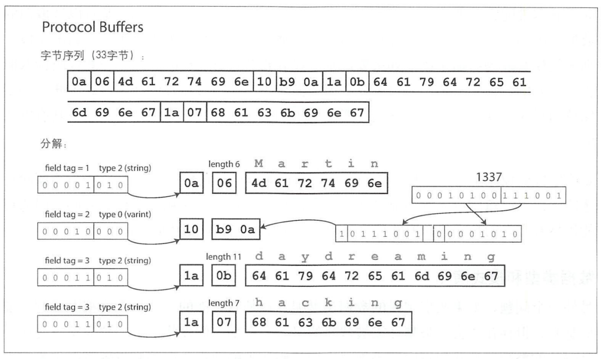

应用程序不可避免地需要随时间而变化、调整，在大多数情况下，更改应用程序功能时，也需要更改其存储的数据：可能需要捕获新的字段或记录类型，或者需要以新的方式呈现已有数据。

当数据格式或模式发生变化时，经常需要对应用程序代码进行相应的调整。但是新旧版本的代码，以及新旧数据格式，可能会同时在系统内共存。为了使系统继续顺利运行，需要保持双向的兼容性：

- **向后兼容**：较新的代码可以读取由旧代码编写的数据。
- **向前兼容**：较旧的代码可以读取由新代码编写的数据。

## 数据编码格式

程序通常使用（至少）两种不同的数据表示形式：

1. 在内存中，数据保存在<u>对象、结构体、列表、数组、哈希表和和树等结构中</u>。这些数据结构针对 CPU 的高效访问和操作进行了优化（通常使用指针）。
2. 将数据写入文件或通过网络发送时，必须将其编码为某种<u>自包含的字节序列（例如 JSON 文档）</u>。由于指针对其他进程没有意义，所以这个字节序列表示看起来与内存中使用的数据结构大不一样。

因此，在这两种表示之间需要进行类型的转化。<u>从内存中的的表示到字节序列的转化</u>称为**编码（或序列化等）**，相反的过程称为**解码（或解析，反序列化）**

### 语言特定的格式

许多编程语言都内置支持将内存中的对象编码为字节序列。这些编码库使用起来非常方便，但因为以下原因使得<u>使用语言内置的编码方案通常不是个好主意</u>：

1. 编码通常与特定的编程语言绑定在一起，大部分时候确定了编码方式就几乎确定了特定的编程语言。对于系统或组织之间的**集成会存在一些困难**。
2. 解码过程中可能会存在**安全问题**：如果攻击者可以让应用程序解码任意的字节序列那么它们可以实例化任意的类；这通常意味着，它们可以做些可怕的事情，比如远程执行任意代码。
3. 为了快速且简单地编码数据，经常**忽略向前和向后兼容性等问题**。
4. 不太重视效率。

### JSON、XML 与二进制变体

JSON、XML 和 CSV 都是文本格式，因此具有不错的可读性。不过 XML 经常被批评过于冗长和不必要的复杂；而 JSON 由于 Web 浏览器的内置支持和相对于 XML 的简单性，更受欢迎。当然，这其中还有一些微妙的问题：

1. **数字编码有很多模糊之处**。在 XML 和 CSV 中无法区分数字和碰巧由数字组成的字符串；JSON 区分字符串和数字但不区分整数和浮点数，并且不指定精度。
2. JSON 和 XML 对 Unicode 字符串（即人类可读文本）有很好的支持，但是它们**不支持二进制字符串（没有字符编码的字节序列）**。
3. XML 和 JSON 都**有可选的模式支持**，而 CSV 没有。

尽管存在缺陷，但仍可以用于很多应用。只要人们就格式本身达成一致，格式多么美观或者高效往往不太重要。

#### 二进制编码

JSON 不像 XML 那么冗长，但与二进制格式相比两者者仍然占用大量空间，于是就开发了大量

```json
{
  "userName": "Martin",
  "favoriteNumber": 1337,
  "interests": ["daydreaming", "hacking"]
}
```

#### MessagePack

MessagePack 是一种 JSON 的二进制编码


#### Thrift

```thrift
struct Person {
  1: required string userName,
  2: optional i64 favoriteNumber,
  3: optional list<string> interests
}
```

Thriift 有两种不同的二进制编码，分别称为 BinaryProtocol 和 CompactProtocol。主要区别在于后者通过将字段类型和标签号打包到单字节中，并使用可变长度整数来实现紧凑性。


#### Protocol Buffers

```proto
message Person {
  required string user_name = 1;
  optional int64 favorite_number = 2;
  repeated string interests = 3;
}
```



#### Avro

Avro 也使用模式来指定编码的数据结构。它有两种模式语言：一种（Avro IDL）用于人工编辑，另一种（基于 JSON ）更易于机器读取。

```Avro
record Person {
  string userName;
  union{null,long} favoriteNumber = null;
  array<string> interests;
}
```

```json
{
  "type": "record",
  "name": "Person",
  "fields": [
    {
      "name": "userName",
      "type": "string"
    },
    {
      "name": "favoriteNumber",
      "type": ["null", "long"],
      "default": null
    },
    {
      "name": "interests",
      "type": { "type": "array", "items": "string" }
    }
  ]
}
```

请注意模式中没有标签编号，是按照顺序遍历这些字段的。


### 字段标签和模式演化

**模式演化**：模式不可避免地需要随着时间而不断变化。

- **读模式**：当应用程序想要对某些数据进行编码（例如将其写入文件或数据库，以及通过网络发送）时，它使用所知道的模式的任何版本来编码数据，例如可以编译到应用程序中的模式。
- **写模式**：当应用程序想要解码某些数据（例如从文件或数据库读取数据，或者从网络接收数据等）时，它期望数据符合某个模式。

#### Thrift、Protocol Buffers

1. 修改字段：标签（field tag）对编码数据的含义至关重要。可以轻松更改模式中字段的名称，而编码永远不直接引用字段名称。但不能随便更改字段的标签，它会导致所有现有编码数据无效。
2. 新增字段：
   - 向前兼容（旧代码可以读取由新代码编写的记录）：当旧代码试图读取新数据时，遇到不能识别的新字段可以进行简单的忽略。
   - 向后兼容（新代码可以读取由旧代码编写的记录）：在模式的初始部署之后添加的每个字段都必须是可选的或具有默认值。
3. 删除字段：之内删除可选的字段，并且不能再使用相同的标签号码。

#### Avro

Avro 的关键思想是，写模式和读模式不必是完全一模一样，它们只需保持兼容。例如：

- 如果写模式和读模式的字段顺序不同，这也没有问题，因为模式解析通过字段名匹配字段。
- 如果读取数据的代码遇到出现在写模式但不在读模式中的字段，则忽略它。
- 如果读取数据的代码需要某个字段，但是写模式不包含该名称的字段，则使用在读模式中声明的默认值填充。


### 模式的优点
