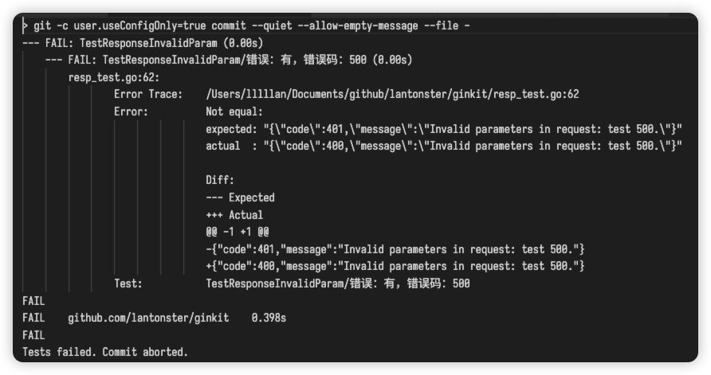

在 `.git/hooks/pre-commit` 中加入以下内容，用于在提交前执行测试（golang 项目）。

```sh
#!/bin/sh

go test ./...
TEST_STATUS=$?

if [ $TEST_STATUS -ne 0 ]; then
    echo "Tests failed. Commit aborted."
    exit 1
fi
```

如果修改了仓库内容，在测试不通过的情况下试图 commit，将会失败：

