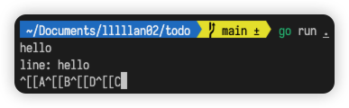
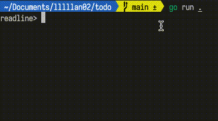

你是否也遇到过，在启动的服务中，试图通过上下键来追溯历史输入时却打出了 `^[[A` 的问题。



```go
scanner := bufio.NewScanner(os.Stdin)
for scanner.Scan() {
  line := scanner.Text()
  fmt.Printf("line: %v\n", line)
}
```

这都是常规的输入会有的问题，如果你也讨厌这个上下左右键的限制，希望能够通过上下键来追溯历史输入，也许你可以试试这个 [readline](https://github.com/chzyer/readline)。



```go
func main() {
	rl, err := readline.New("readline> ")
	if err != nil {
		panic(err)
	}
	defer rl.Close()

	for {
		line, err := rl.Readline()
		if err != nil {
			break
		}
		fmt.Printf("line: %v\n", line)
	}
}
```