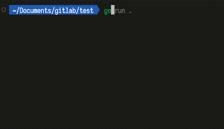
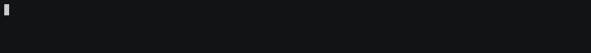
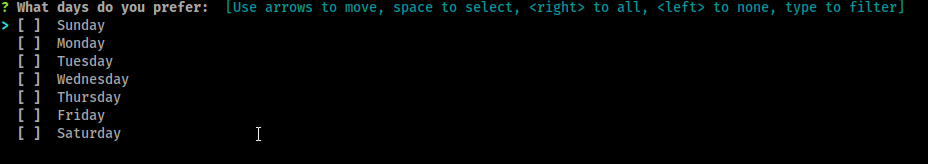

[Survey](https://github.com/AlecAivazis/survey) 是一个轻量级的命令行交互库，它提供了一套简单的问题类型，并支持多种类型的答案。

## 安装

```sh
go get github.com/AlecAivazis/survey
```

## 示例

<center></center>

```go
package main

import (
	"fmt"

	"github.com/AlecAivazis/survey/v2"
)

// the questions to ask
var qs = []*survey.Question{
	{
		Name:      "name",
		Prompt:    &survey.Input{Message: "What is your name?"},
		Validate:  survey.Required,
		Transform: survey.Title,
	},
	{
		Name: "color",
		Prompt: &survey.Select{
			Message: "Choose a color:",
			Options: []string{"red", "blue", "green"},
			Default: "red",
		},
	},
	{
		Name:   "age",
		Prompt: &survey.Input{Message: "How old are you?"},
	},
}

func main() {
	// the answers will be written to this struct
	answers := struct {
		Name          string // survey will match the question and field names
		FavoriteColor string `survey:"color"` // or you can tag fields to match a specific name
		Age           int    // if the types don't match, survey will convert it
	}{}

	// perform the questions
	err := survey.Ask(qs, &answers)
	if err != nil {
		fmt.Println(err.Error())
		return
	}

	fmt.Printf("%s chose %s.\n", answers.Name, answers.FavoriteColor)
}
```

## 提示

### 输入

```go
name := ""
prompt := &survey.Input{
  Message: "ping",
}
survey.AskOne(prompt, &name)
```

#### 建议选项



```go
file := ""
prompt := &survey.Input{
  Message: "inform a file to save:",
  Suggest: func (toComplete string) []string {
    files, _ := filepath.Glob(toComplete + "*")
    return files
  },
}
survey.AskOne(prompt, &file)
```

### 多次换行确认

```go
text := ""
prompt := &survey.Multiline{
  Message: "ping",
}
survey.AskOne(prompt, &text)
```

### 密码

```go
password := ""
prompt := &survey.Password{
  Message: "Please type your password",
}
survey.AskOne(prompt, &password)
```

### 确认

```go
name := false
prompt := &survey.Confirm{
  Message: "Do you like pie?",
}
survey.AskOne(prompt, &name)
```

### 单选

```go
color := ""
prompt := &survey.Select{
  Message: "Choose a color:",
  Options: []string{"red", "blue", "green"},
}
survey.AskOne(prompt, &color)
```

来自 Select 提示的字段和值可以是两种不同的东西之一。如果您传递一个 int，则该字段将具有所选索引的值。如果您传递一个字符串，则所选的字符串值将写入该字段。

用户也可以通过 j 和 k 键的选项按 esc 切换能力循环，分别做向下和向上。

默认情况下，选择提示仅限于一次显示 7 个选项，并将分页显示超过此时间的选项列表。这可以通过多种方式进行更改：

```go
// 作为单个选择上的字段
prompt := &survey.MultiSelect{..., PageSize: 10}

// 或作为询问或 AskOne 的选项
survey.AskOne(prompt, &days, survey.WithPageSize(10))
```

#### 选择选项说明

可选的描述文本可用于向选择提示中列出的每个选项添加额外信息：

```go
color := ""
prompt := &survey.Select{
  Message: "Choose a color:",
  Options: []string{"red", "blue", "green"},
  Description: func(value string, index int) string {
    if value == "red" {
      return "My favorite color"
    }
    return ""
  },
}
survey.AskOne(prompt, &color)

// 假设用户选择了“红色-我最喜欢的颜色”：
fmt.Println(color) //=> "red"
```

### 多选



```go
days := []string{}
prompt := &survey.MultiSelect{
  Message: "What days do you prefer:",
  Options: []string{"Sunday", "Monday", "Tuesday", "Wednesday", "Thursday", "Friday", "Saturday"},
}
survey.AskOne(prompt, &days)
```

来自 MultiSelect 提示的字段和值可以是两种不同的东西之一。如果您传递一个 int，则该字段将具有选定索引的切片。如果您传递一个字符串，则选定的字符串值的切片将写入该字段。

用户也可以通过 j 和 k 键的选项按 esc 切换能力循环，分别做向下和向上。

默认情况下，MultiSelect 提示仅限于一次显示 7 个选项，并将分页显示超过此时间的选项列表。这可以通过多种方式进行更改：

```go
// 作为多选上的字段
prompt := &survey.MultiSelect{..., PageSize: 10}

// 或作为询问或 AskOne 的选项
survey.AskOne(prompt, &days, survey.WithPageSize(10))
```

### 编辑

在临时文件上启动用户首选的编辑器（由 $VISUAL 或 $EDITOR 环境变量定义）。一旦用户退出编辑器，临时文件的内容将作为结果读取。如果两者都不存在，则使用记事本（在 Windows 上）或 vim（Linux 或 Mac）。

您还可以为临时文件的名称指定模式 。这对于确保语法突出显示与您的使用情况匹配很有用。

```go
prompt := &survey.Editor{
  Message: "Shell code snippet",
  FileName: "*.sh",
}

survey.AskOne(prompt, &content)
```
