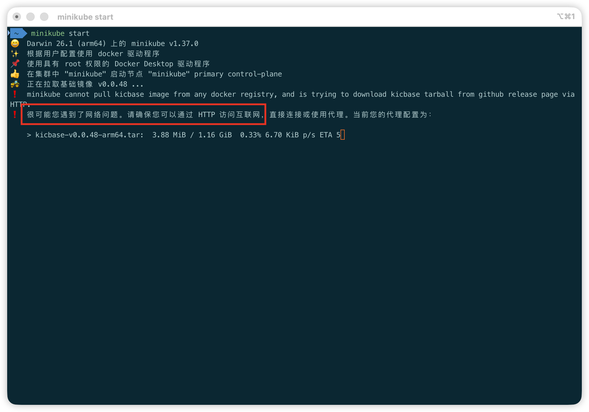

# 一、使用 Homebrew 安装 -> [官方文档](https://minikube.kubernetes.ac.cn/docs/start/?arch=%2Fmacos%2Farm64%2Fstable%2Fhomebrew)

```shell
brew install minikube
```

# 二、启动 minikube

安装完以后通过 start 启动

```shell
minikube start
```

## 2.1 [Docker 作为驱动](https://minikube.kubernetes.ac.cn/docs/drivers/docker/)

[在 Mac 上安装 Docker Desktop](https://docs.container.net.cn/desktop/setup/install/mac-install/)

如果安装过 docker，docker 大概率会成为 minikube 的默认驱动。则直接 `minikube start` 与下面指定 docker 作为驱动方式启动等效

```shell
minikube start --driver docker
```

然后大概率会因为基础镜像拉取不下来，自动更换了代理重新拉取。如果你忍受不了这个下载速度，可以自己拉取。



### 2.1.1 更换阿里镜像源拉取基础镜像

> 请将命令中的 v0.0.48 替换成你在 minikube start 命令中看到的基础镜像版本

```shell
docker pull registry.cn-hangzhou.aliyuncs.com/google_containers/kicbase:v0.0.48
```

### 2.1.2 启动时指定镜像

拉取下来以后指定镜像来启动 minikube

```shell
minikube start --base-image='registry.cn-hangzhou.aliyuncs.com/google_containers/kicbase:v0.0.48'
```

## 2.2 [VFkit 作为驱动](https://minikube.kubernetes.ac.cn/docs/drivers/vfkit/)

### 2.2.1 安装 vfkit

可以用 brew 安装 [vfkit](https://github.com/crc-org/vfkit)

```shell
brew install vfkit
```

### 2.2.2 安装 vmnet-helper

如果要访问其他集群或运行多节点集群，还需要 vmnet-shared 网络，安装 [vmnet-helper](https://github.com/nirs/vmnet-helper)


```shell
curl -fsSL https://github.com/nirs/vmnet-helper/releases/latest/download/install.sh | bash
```

### 2.2.3 授予运行 vmnet-helper 的权限

```shell
sudo install -m 0640 /opt/vmnet-helper/share/doc/vmnet-helper/sudoers.d/vmnet-helper /etc/sudoers.d/
```

### 2.2.4 启动

```shell
minikube start --driver vfkit --network vmnet-shared
```