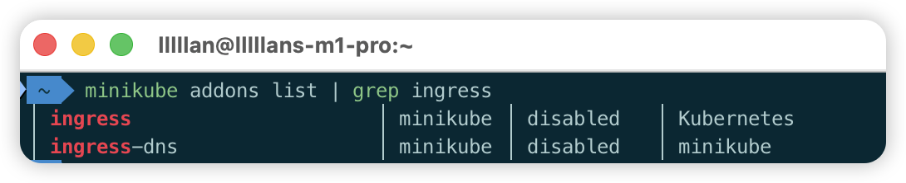
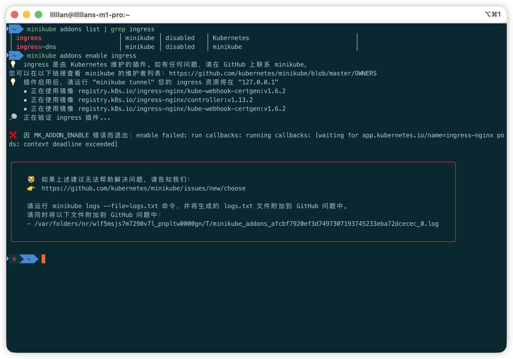
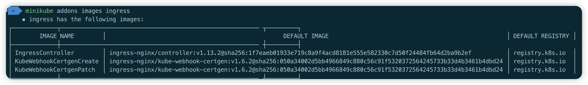

minikube 为了方便本地开发，内置了 nginx-ingress 控制器作为可选组件，但默认是禁用状态，需要手动启用。

在启用 Ingress 之前，建议先检查当前的状态，确认是否需要启用。

## 查看 Ingress Controller 状态

先执行这条命令检查 Ingress Controller 的状态：

```shell
minikube addons list | grep ingress
```



如果显示 `enabled` 则表示已启用，无需再进行操作。如果显示 `disabled` 则需要按照下面的步骤手动开启。

## 开启 Ingress

使用以下命令启用 Ingress：

```shell
minikube addons enable ingress
```

如果网络环境良好，命令执行后会自动拉取所需的镜像并完成部署。但在国内网络环境下，基本上都会遇到拉取镜像失败的问题。



遇到镜像拉取失败时，需要将镜像替换为国内可用的镜像源。首先需要了解 Ingress 需要用到哪些镜像。

### 查看 Ingress 默认镜像

执行以下命令查看 Ingress 组件所需的镜像列表：

```shell
minikube addons images ingress
```



### 查找可用镜像源

获取镜像列表后，到[这类镜像网站](https://docker.aityp.com/)找到每个镜像对应的国内可用镜像源。

### 使用国内镜像启用 Ingress

找到可用的镜像源后，使用 `--registries` 和 `--images` 参数指定镜像仓库和镜像名称来启用 Ingress。命令格式如下：

```shell
minikube addons enable ingress \
--registries="IngressController=$IngressController.registry$,\
KubeWebhookCertgenCreate=$KubeWebhookCertgenCreate.registry$,\
KubeWebhookCertgenPatch=$KubeWebhookCertgenPatch.registry$" \
--images="IngressController=$IngressController.image$,\
KubeWebhookCertgenCreate=$KubeWebhookCertgenCreate.image$,\
KubeWebhookCertgenPatch=$KubeWebhookCertgenPatch.image$"
```

> 注意：上述命令中的 `$IngressController.registry$` 等为占位符，需要替换为实际的镜像仓库地址和镜像名称。

实际使用示例：
```shell
minikube addons enable ingress \
--registries="IngressController=swr.cn-north-4.myhuaweicloud.com,\
KubeWebhookCertgenCreate=swr.cn-north-4.myhuaweicloud.com,\
KubeWebhookCertgenPatch=swr.cn-north-4.myhuaweicloud.com" \
--images="IngressController=ddn-k8s/registry.k8s.io/ingress-nginx/controller:v1.13.2-linuxarm64,\
KubeWebhookCertgenCreate=ddn-k8s/registry.k8s.io/ingress-nginx/kube-webhook-certgen:v1.6.2-linuxarm64,\
KubeWebhookCertgenPatch=ddn-k8s/registry.k8s.io/ingress-nginx/kube-webhook-certgen:v1.6.2-linuxarm64"
```