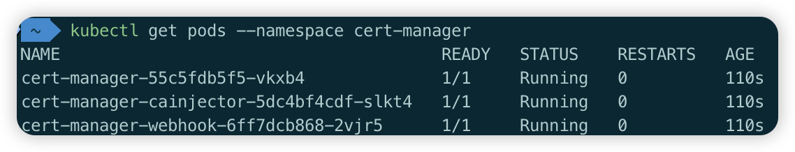

安装 rancher 的[官方文档](https://ranchermanager.docs.rancher.com/zh/getting-started/installation-and-upgrade/install-upgrade-on-a-kubernetes-cluster#kubernetes-%E9%9B%86%E7%BE%A4)

# 先决条件

在开始安装 Rancher 之前，需要确保满足以下先决条件：

- Kubernetes 集群（本文使用 minikube）
- Ingress Controller（minikube 中已内置，但需要手动启用）
- Helm CLI 工具

## 

如果还没有安装 minikube，请参考该文章进行安装。在 macOS 上使用 Homebrew 安装非常方便。

##  

Rancher 需要通过 Ingress 来暴露服务，因此需要先启用 Ingress Controller。请参考该文章完成 Ingress 的启用。

# 安装 Rancher Helm Chart

## 1. 添加 Helm Chart 仓库

首先需要添加包含 Rancher Chart 的 Helm 仓库。Rancher 提供了多个版本通道，一般选择 Stable 版本即可，除非你想体验一些还未发布的试验性功能。更多版本选择信息请参考[Rancher 版本选择](https://ranchermanager.docs.rancher.com/zh/getting-started/installation-and-upgrade/resources/choose-a-rancher-version)。

执行以下命令添加 Stable 版本的 Helm 仓库：


```shell
helm repo add rancher-stable https://releases.rancher.com/server-charts/stable
```

## 2. 为 Rancher 创建命名空间

在安装 Rancher 之前，需要创建一个 Kubernetes 命名空间用于存放 Rancher 相关的资源。Rancher 使用 `cattle-system` 作为默认命名空间：

```shell
kubectl create namespace cattle-system
```

## 3. 选择 SSL 配置

Rancher Management Server 默认需要 SSL/TLS 配置来保证访问的安全性。

Rancher 提供了三种 SSL 配置选项：Rancher 生成的证书（默认）、Let's Encrypt 和你已有的证书。对于本地开发环境，使用 Rancher 生成的证书（默认选项）即可，该选项需要安装 cert-manager 来管理证书。更多详见[选择 SSL 配置](https://ranchermanager.docs.rancher.com/zh/getting-started/installation-and-upgrade/install-upgrade-on-a-kubernetes-cluster#3-%E9%80%89%E6%8B%A9-ssl-%E9%85%8D%E7%BD%AE)


### 安装 cert-manager

> 如果你使用自己的证书文件（ingress.tls.source=secret）或使用[外部负载均衡器的 TLS 终止](https://ranchermanager.docs.rancher.com/zh/getting-started/installation-and-upgrade/installation-references/helm-chart-options#%E5%A4%96%E9%83%A8-tls-%E7%BB%88%E6%AD%A2)，你可以跳过此步骤。

使用 Rancher 生成的证书需要先安装 cert-manager。cert-manager 是一个用于 Kubernetes 的证书管理工具，负责自动颁发和管理 TLS 证书。

首先添加 Jetstack Helm 仓库：

```shell
helm repo add jetstack https://charts.jetstack.io
```

更新本地 Helm Chart 仓库缓存：

```shell
helm repo update
```

安装 cert-manager Helm Chart。更多配置选项请参阅[cert-manager 文档](https://artifacthub.io/packages/helm/cert-manager/cert-manager#configuration)：

```shell
helm install \
  cert-manager jetstack/cert-manager \
  --namespace cert-manager \
  --create-namespace \
  --version v1.19.1 \
  --set crds.enabled=true
```

安装完 cert-manager 后，你可以通过检查 cert-manager 命名空间中正在运行的 Pod 来验证它是否已正确部署：

```shell
kubectl get pods --namespace cert-manager
```



## 4. 通过 Helm 安装 Rancher

> 默认情况是使用 Rancher 生成 CA，并使用 cert-manager 颁发用于访问 Rancher Server 接口的证书。
> 如果你选择了 Let's Encrypt 或自己的证书文件，需要执行[不同的安装命令](https://ranchermanager.docs.rancher.com/zh/getting-started/installation-and-upgrade/install-upgrade-on-a-kubernetes-cluster#5-%E6%A0%B9%E6%8D%AE%E4%BD%A0%E9%80%89%E6%8B%A9%E7%9A%84%E8%AF%81%E4%B9%A6%E9%80%89%E9%A1%B9%E9%80%9A%E8%BF%87-helm-%E5%AE%89%E8%A3%85-rancher)

### 配置本地 Hosts

由于是本地部署，需要通过配置 hosts 文件将自定义域名解析到 Minikube 节点的 IP 地址。按照以下步骤操作：

1. 获取 Minikube 节点 IP 地址：
```shell
minikube ip
```

2. 编辑本地 hosts 文件（需要管理员权限）：
    - Windows：`C:\Windows\System32\drivers\etc\hosts`
    - Mac/Linux：`/etc/hosts`

3. 添加域名解析记录（将 Minikube IP 和自定义域名绑定）：
```txt
192.168.105.13 rancher.minikube
```

### 安装 Rancher

> 更多配置项参考[Rancher Helm Chart 选项](https://ranchermanager.docs.rancher.com/zh/getting-started/installation-and-upgrade/installation-references/helm-chart-options)

执行以下命令安装 Rancher。注意将 `rancher-stable` 替换为你在第一步中添加的 Helm Chart 仓库名称（如果选择的是 stable 版本则保持不变）。由于国内网络环境，这里使用了国内镜像源来加速镜像拉取：

```shell
helm install rancher rancher-stable/rancher \
  --namespace cattle-system \
  --set hostname=rancher.minikube \
  --set bootstrapPassword=admin \
  --set systemDefaultRegistry=registry.cn-hangzhou.aliyuncs.com \
  --set rancherImage=registry.cn-hangzhou.aliyuncs.com/rancher/rancher
```

安装完成后，等待 Rancher 部署完成。可以通过以下命令查看部署状态：

```shell
kubectl -n cattle-system rollout status deploy/rancher
```

## 5. 验证 Rancher Server 是否部署成功

等待部署完成后，可以通过以下命令验证 Rancher 是否正常运行：

```shell
kubectl get pods -n cattle-system
```

所有 Pod 的状态应该为 `Running`，表示 Rancher 已成功部署。

## 6. 访问 Rancher

部署成功后，可以通过以下地址访问 Rancher 管理界面：

```txt
https://rancher.minikube
```

> 注意：由于使用了 SSL/TLS 证书，访问地址需要使用 `https` 协议。首次访问时浏览器可能会提示证书不受信任，这是因为使用的是 Rancher 自签名证书，选择"继续访问"或"高级"->"继续访问"即可。