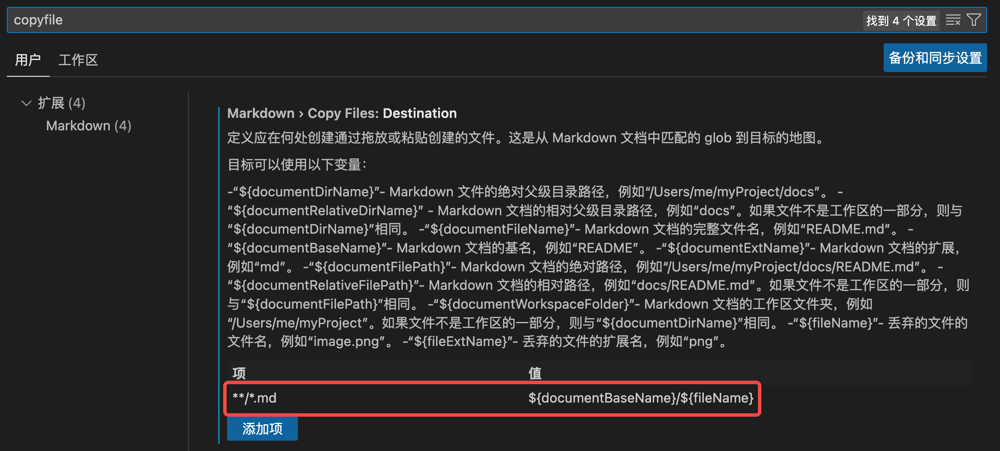

## 背景

vscode 在编写 markdown 时粘贴图片，能够快捷地保存图片并引用，不过默认的是保存在当前目录下。

在 [hexo 使用 Markdown 嵌入图片](/hexo/asset_folder) 一文中我们采用了将图片保存在同名文件夹下直接引入的方式，因此我们需要想办法改变一下 vscode 中保存图片的位置。

## 方法

在 vscode 的设置中找到 `Markdown > Copy Files > Destination`，在下面添加一项，项为 `**/*.md`，值为 `${documentBaseName}/${fileName}`。
如此以来，直接粘图片将自动保存在文章的同名目录下，并且以 `` 的形式引用，好在 hexo 的自动解析文章路径，在图片引用中写入文件夹名也是可以成功的。这样我们便同时达到了 vscode 中能成功预览图片和生成网站能正确显示图片的效果。

