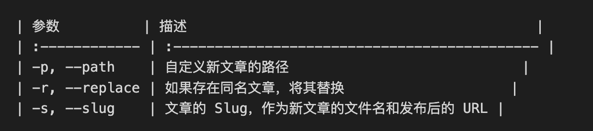
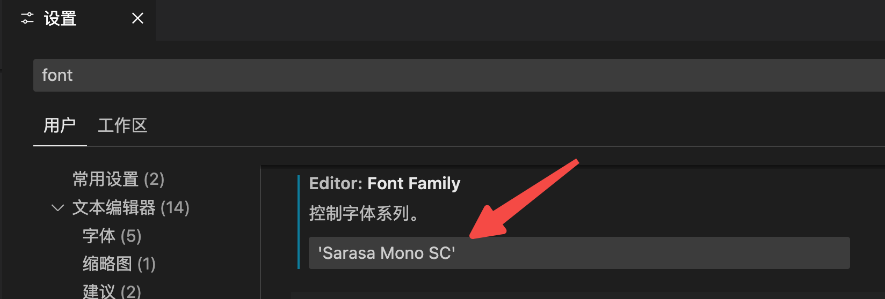
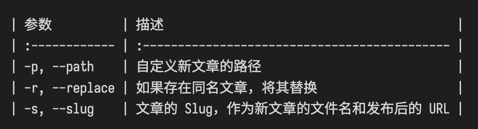

## 困扰

使用 vscode 写 markdown 时对表格进行格式化，当夹杂了中英两种字符的时候，格式化的内容就不能优雅地对齐了。

## 等宽字体

解决办法便是使用等宽字体。

本文使用的是 `Sarasa Mono SC`，[官方下载地址](https://github.com/be5invis/Sarasa-Gothic/releases) ，或者快速下载地址:  [Sarasa-Regular.ttc](Sarasa-Regular.ttc)，直接安装即可。

然后到 vscode 的配置中修改首选字体：

## 效果

